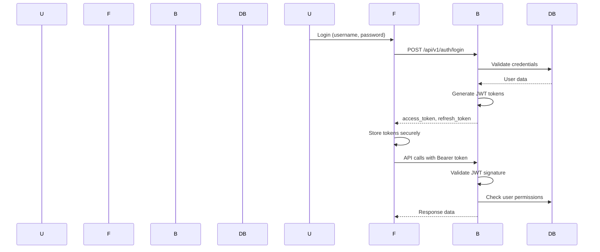

# OpenKMS Architecture Documentation

## Overview

OpenKMS is a modern knowledge management system designed for enterprise deployment, built on a microservices architecture with clear separation of concerns. This document provides a comprehensive overview of the system architecture, design patterns, and deployment considerations.

## Architectural Principles

### Core Principles
- **Separation of Concerns**: Clear boundaries between frontend, backend, and infrastructure
- **Scalability**: Horizontal scalability through containerization and service independence
- **Maintainability**: Modern tooling, automated testing, and comprehensive documentation
- **Security**: Defense-in-depth with multiple security layers
- **Performance**: Async operations, caching, and optimized database queries
- **Accessibility**: WCAG compliance and responsive design

### Design Philosophies
- **Domain-Driven Design**: Business logic organized around domain entities
- **Clean Architecture**: Dependency inversion and separation of layers
- **API-First**: RESTful API design with OpenAPI documentation
- **Container-Native**: Built for Docker orchestration from the ground up
- **Infrastructure as Code**: All infrastructure defined in code

---

## High-Level Architecture

### System Architecture Overview

```
┌─────────────────────────────────────────────────────────────────────────────────┐
│                            Client Layer                                        │
├─────────────────────────────────────────────────────────────────────────────────┤
│                                                                                 │
│  ┌─────────────────┐  ┌─────────────────┐  ┌─────────────────┐           │
│  │   Web Browser   │  │   Mobile App    │  │   API Client    │           │
│  │   (Blazor UI)    │  │   (Future)      │  │   (REST API)    │           │
│  └─────────────────┘  └─────────────────┘  └─────────────────┘           │
│                     │                    │                     │
│                     └────────────────────┼─────────────────────┘                     │
│                                          │                                   │
└─────────────────────────────────────────────────────────────────────────────────┘
                                          │
                                          ▼
┌─────────────────────────────────────────────────────────────────────────────────┐
│                          Presentation Layer                                     │
├─────────────────────────────────────────────────────────────────────────────────┤
│                                                                                 │
│  ┌─────────────────────────────────────────────────────────────────────────┐   │
│  │                    Reverse Proxy                                            │   │
│  │                     (Nginx)                                               │   │
│  │  • SSL/TLS Termination                                                     │   │
│  │  • Load Balancing                                                          │   │
│  │  • Static Asset Serving                                                    │   │
│  │  • Rate Limiting                                                           │   │
│  └─────────────────────────────────────────────────────────────────────────┘   │
│                                         │                                   │
│                     ┌─────────────────────┼─────────────────────┐             │
│                     │                     │                     │             │
│              ┌──────┴──────┐     │   ┌──────┴──────┐     │   ┌──────┴──────┐    │
│              │ Web Server  │     │   │ API Gateway │     │   │ Web Server  │    │
│              │  (Kestrel)  │     │   │ (FastAPI)   │     │   │  (Kestrel)  │    │
│              └─────────────┘     │   └─────────────┘     │   └─────────────┘    │
│                                 │                     │                       │
└─────────────────────────────────┼─────────────────────┼───────────────────────┘
                                │                     │
                                ▼                     ▼
┌─────────────────────────────────────────────────────────────────────────────────┐
│                         Application Layer                                      │
├─────────────────────────────────────────────────────────────────────────────────┤
│                                                                                 │
│  ┌─────────────────────────────┐  ┌──────────────────────────────────────────┐ │
│  │   Frontend Application      │  │        Backend API Services                │ │
│  │                            │  │                                          │ │
│  │  • Blazor Server            │  │  • Authentication Service                 │ │
│  │  • C# / .NET 8              │  │  • User Management Service               │ │
│  │  • Bootstrap UI             │  │  • Training Management Service           │ │
│  │  • SignalR (Real-time)      │  │  • Registration Service                   │ │
│  │  • JWT Authentication        │  │  • Analytics Service                     │ │
│  └─────────────────────────────┘  └──────────────────────────────────────────┘ │
│                                         │                                   │
└─────────────────────────────────────────────────────────────────────────────────┘
                                          │
                                          ▼
┌─────────────────────────────────────────────────────────────────────────────────┐
│                            Infrastructure Layer                                   │
├─────────────────────────────────────────────────────────────────────────────────┤
│                                                                                 │
│  ┌─────────────────┐  ┌─────────────────┐  ┌─────────────────┐  ┌─────────────┐ │
│  │   PostgreSQL    │  │      Redis       │  │   File System   │  │  Message    │ │
│  │                 │  │                 │  │                 │  │   Queue     │ │
│  │  • Primary DB   │  │  • Cache Layer   │  │  • Uploads       │  │ (Future)    │ │
│  │  • User Data     │  │  • Session Store │  │  • Logs          │  │             │ │
│  │  • Training Data │  │  • Rate Limit   │  │  • Backups       │  │             │ │
│  │  • Metadata      │  │  • Pub/Sub       │  │  • Exports       │  │             │ │
│  └─────────────────┘  └─────────────────┘  └─────────────────┘  └─────────────┘ │
│                                                                                 │
└─────────────────────────────────────────────────────────────────────────────────┘
```

### Communication Patterns

#### Client-Server Communication
- **HTTP/REST**: Primary communication between frontend and backend
- **SignalR**: Real-time updates (notifications, live updates)
- **WebSocket**: Direct WebSocket connections for specific features

#### Service-to-Service Communication
- **HTTP/REST**: Internal service communication
- **Database**: Shared PostgreSQL database for transactional data
- **Redis**: Shared cache and message broker
- **Future**: Message queue for async processing

---

## Component Architecture

### Frontend Architecture (Blazor Server)

#### Component Hierarchy
```
App.razor (Root)
└── MainLayout.razor (Application Layout)
    ├── NavMenu.razor (Navigation)
    ├── CascadingAuthenticationState (Auth Context)
    ├── ErrorBoundary (Error Handling)
    └── @Body (Dynamic Content)
        ├── Auth/ (Authentication Pages)
        ├── Admin/ (Administration)
        ├── Training/ (Training Features)
        └── Home/ (Dashboard)
```

#### Key Architectural Patterns
- **Component-Based Architecture**: Reusable UI components
- **Dependency Injection**: Service injection throughout components
- **State Management**: Component-local state with service layer
- **Authentication Cascading**: Authentication state flows through component tree
- **Error Boundaries**: Graceful error handling at component level

#### Service Layer Architecture
```
Services/
├── AuthService.cs (Authentication)
├── BaseApiService.cs (HTTP Communication)
├── UserService.cs (User Management)
├── TrainingService.cs (Training Data)
└── RegistrationService.cs (Registration Logic)
```

### Backend Architecture (FastAPI)

#### Layered Architecture
```
app/
├── main.py (Application Entry)
├── core/ (Core Infrastructure)
│   ├── config.py (Configuration)
│   ├── database.py (Database Setup)
│   └── security.py (Security Utilities)
├── api/
│   ├── v1/ (API Version)
│   │   ├── router.py (Route Registration)
│   │   ├── deps.py (Dependencies)
│   │   └── endpoints/ (Endpoint Modules)
│   │       ├── auth.py (Authentication)
│   │       ├── users.py (User Management)
│   │       ├── trainings.py (Training)
│   │       └── registrations.py (Registration)
├── models/ (Data Models)
│   ├── user.py (User Entity)
│   ├── training.py (Training Entity)
│   └── registration.py (Registration Entity)
├── schemas/ (Pydantic Schemas)
│   ├── user.py (User Validation)
│   ├── training.py (Training Validation)
│   └── registration.py (Registration Validation)
└── services/ (Business Logic)
    ├── auth.py (Authentication Service)
    ├── user.py (User Service)
    ├── training.py (Training Service)
    └── registration.py (Registration Service)
```

#### API Design Patterns
- **Dependency Injection**: Database sessions, services via FastAPI dependency system
- **Repository Pattern**: Data access abstraction (implied by SQLAlchemy usage)
- **Service Layer**: Business logic separation from controllers
- **DTO Pattern**: Schema validation and data transformation
- **Middleware**: Authentication, CORS, logging

---

## Data Architecture

### Database Design

#### Core Entities
```
Users (User Management)
├── id (UUID)
├── username (varchar) - Unique
├── email (varchar) - Unique
├── full_name (varchar)
├── hashed_password (varchar)
├── role (enum: EMPLOYEE, KNOWLEDGE_MANAGER, ADMIN)
├── department (varchar, nullable)
├── office_location (varchar, nullable)
├── is_active (boolean)
└── timestamps (created_at, updated_at)

TrainingPrograms (Training Content)
├── id (UUID)
├── title (varchar)
├── description (text)
├── category (enum: SECURITY, LEADERSHIP, TECHNICAL, COMPLIANCE)
├── level (enum: BEGINNER, INTERMEDIATE, ADVANCED)
├── status (enum: DRAFT, PUBLISHED)
├── duration_minutes (integer)
├── credits (integer)
├── max_participants (integer)
├── instructor_id (FK -> Users.id)
└── timestamps

TrainingSchedules (Training Sessions)
├── id (UUID)
├── training_id (FK -> TrainingPrograms.id)
├── start_datetime (timestamp)
├── end_datetime (timestamp)
├── location (varchar)
├── max_participants (integer)
├── is_virtual (boolean)
├── meeting_link (varchar, nullable)
└── timestamps

TrainingRegistrations (User Enrollments)
├── id (UUID)
├── user_id (FK -> Users.id)
├── training_id (FK -> TrainingPrograms.id)
├── schedule_id (FK -> TrainingSchedules.id, nullable)
├── status (enum: REGISTERED, ATTENDED, CANCELLED, COMPLETED)
├── registered_at (timestamp)
├── attended_at (timestamp, nullable)
├── completion_date (timestamp, nullable)
├── feedback_score (integer, 1-5, nullable)
└── timestamps
```

#### Database Constraints & Indexes
```sql
-- Unique constraints
ALTER TABLE users ADD CONSTRAINT users_username_unique UNIQUE (username);
ALTER TABLE users ADD CONSTRAINT users_email_unique UNIQUE (email);

-- Foreign key constraints
ALTER TABLE training_programs ADD CONSTRAINT training_programs_instructor_id_fkey
    FOREIGN KEY (instructor_id) REFERENCES users(id);

-- Indexes for performance
CREATE INDEX idx_training_registrations_user_id ON training_registrations(user_id);
CREATE INDEX idx_training_registrations_training_id ON training_registrations(training_id);
CREATE INDEX idx_training_programs_category ON training_programs(category);
CREATE INDEX idx_training_programs_status ON training_programs(status);
```

#### Data Access Patterns
- **Async Operations**: All database operations use async/await
- **Connection Pooling**: SQLAlchemy connection management
- **Transaction Management**: Atomic operations for complex updates
- **Migration Strategy**: Alembic for schema versioning
- **Soft Deletes**: Logical deletion for audit purposes

### Caching Architecture

#### Redis Integration
```
Cache Structure:
├── authentication/
│   ├── user_sessions:{user_id}
│   └── jwt_blacklist:{token_hash}
├── application/
│   ├── user_permissions:{user_id}
│   ├── training_catalog
│   └── system_settings
└── performance/
    ├── frequently_accessed_data
    └── api_response_cache
```

#### Caching Strategies
- **Session Cache**: User authentication state (5 minute TTL)
- **Data Cache**: Training catalog and user data (30 minute TTL)
- **Query Cache**: Frequently accessed reports (15 minute TTL)
- **Invalidation**: Manual cache invalidation on data updates

---

## Security Architecture

### Authentication & Authorization

#### Multi-Layer Security
```
Security Layers:
├── Network Level (SSL/TLS, CORS)
├── Application Level (JWT, Rate Limiting)
├── Data Level (Encryption, Validation)
└── Infrastructure Level (Container Security)
```

#### JWT Authentication Flow


#### Security Features
- **JWT Tokens**: Stateless authentication with configurable expiration
- **Role-Based Access**: Granular permissions by user role
- **Password Security**: bcrypt hashing with complexity requirements
- **Input Validation**: Pydantic schema validation and SQL injection prevention
- **Secure Headers**: CORS, CSP, HSTS configuration

### Data Security

#### Encryption & Privacy
- **Data at Rest**: Database encryption, sensitive field encryption
- **Data in Transit**: TLS 1.3 encryption for all communications
- **Data Processing**: Secure memory handling, sensitive data masking
- **Audit Logging**: Comprehensive audit trails for security events

#### Compliance Considerations
- **GDPR Compliance**: Data subject rights, consent management
- **Data Retention**: Configurable retention policies
- **Privacy by Design**: Minimal data collection, purpose limitation
- **Access Controls**: Principle of least privilege

---

## Infrastructure Architecture

### Containerization Strategy

#### Docker Compose Orchestration
```yaml
Service Network Architecture:
├── openkms-network (172.20.0.0/16)
│   ├── postgres (5432)
│   ├── redis (6379)
│   ├── backend (8000)
│   ├── frontend (8080)
│   └── nginx (80/443 - production)
```

#### Container Health Management
- **Health Checks**: Container health monitoring with dependencies
- **Auto-restart**: Self-healing container policies
- **Resource Limits**: CPU and memory constraints per service
- **Log Management**: Structured logging and aggregation

### Network Architecture

#### Service Communication
```
Network Flow:
┌─────────────┐    HTTP/HTTPS    ┌─────────────┐    HTTP      ┌─────────────┐
│   Client    │ ──────────────────▶│   Nginx     │ ─────────────▶│  Frontend   │
│ (Browser)   │                    │ (Reverse    │             │ (Blazor     │
└─────────────┘                    │  Proxy)     │             │  Server)    │
                  ┌─────────────────└─────────────┘             └─────────────┘
                  │                            │                            │
                  │ WebSocket                 │ HTTP                       │
                  │                           ▼                            ▼
                  │                    ┌─────────────┐    HTTP      ┌─────────────┐
                  └────────────────────▶│   Backend   │ ─────────────▶│   Database  │
                                       │ (API         │             │ (PostgreSQL)│
                                       │  Service)    │             └─────────────┘
                                       └─────────────┘                    │
                                              │                            │
                                              │ Cache                      │
                                              ▼                            │
                                       ┌─────────────┐                    │
                                       │    Redis     │ ◄──────────────────┘
                                       │ (Cache)      │
                                       └─────────────┘
```

#### Security Zones
- **DMZ**: Nginx reverse proxy with firewall rules
- **Application Zone**: Frontend and backend services
- **Data Zone**: Database and cache services
- **Management Zone**: Monitoring and backup services

### Storage Architecture

#### Data Storage Strategy
```
Persistent Volumes:
├── postgres_data (/var/lib/postgresql/data)
├── redis_data (/var/lib/redis/data)
├── openkms_logs (/app/logs)
└── openkms_uploads (/app/uploads)
```

#### Backup Strategy
- **Database Backups**: Automated daily backups with retention policy
- **File Backups**: Volume snapshots for uploads and logs
- **Disaster Recovery**: Multi-region replication (enterprise)
- **Version Control**: Schema and configuration versioning

---

## Performance Architecture

### Scalability Patterns

#### Horizontal Scaling
```
Scaling Strategy:
├── Stateless Services: Backend and frontend containers
├── Database: Read replicas + connection pooling
├── Cache: Redis cluster for distributed caching
└── Load Balancing: Nginx reverse proxy distribution
```

#### Performance Optimization
- **Database**: Connection pooling, query optimization, indexing
- **Caching**: Multi-level caching strategy
- **API**: Async operations, response compression, pagination
- **Frontend**: Component optimization, lazy loading, asset bundling

### Monitoring & Observability

#### Metrics Collection
```
Monitoring Stack:
├── Application Metrics (Custom)
│   ├── API Response Times
│   ├── Database Query Performance
│   ├── Authentication Events
│   └── User Activity Analytics
├── Infrastructure Metrics (Container)
│   ├── CPU/Memory Usage
│   ├── Network Latency
│   ├── Disk I/O
│   └── Container Health
├── Business Metrics
│   ├── Training Completion Rates
│   ├── User Engagement
│   ├── System Utilization
│   └── Registration Analytics
└── Security Metrics
    ├── Authentication Failures
    ├── API Rate Limiting
    ├── Suspicious Activity
    └── Compliance Monitoring
```

#### Logging Architecture
```yaml
Log Structure:
- timestamp: ISO 8601 timestamp
- level: DEBUG, INFO, WARNING, ERROR, CRITICAL
- service: Service identifier (backend, frontend)
- user_id: Authenticated user ID (if applicable)
- request_id: Correlation ID for request tracing
- message: Human-readable log message
- metadata: Structured data (error details, performance metrics)
```

---

## Deployment Architecture

### Environment Strategy

#### Multi-Environment Setup
```
Environment Pipeline:
Development ──▶ Testing ──▶ Staging ──▶ Production
    │             │          │          │
    │             │          │          ├── Blue/Green
    │             │          │          ├── Canary
    │             │          │          └── Rollback
    │             │          │
    Docker Compose  Docker    Docker    Kubernetes
                Swarm     Compose
```

#### Configuration Management
- **Environment Variables**: Decoupled configuration via .env files
- **Secrets Management**: Encrypted secrets with rotation policies
- **Feature Flags**: Dynamic feature toggling
- **Configuration Validation**: Environment-specific validation rules

### CI/CD Architecture

#### Automated Deployment Pipeline
```
 Pipeline Stages:
1. Code Commit (Git)
   ├── Repository Hooks
   ├── Code Quality Checks
   └── Automated Testing

2. Build & Test (CI)
   ├── Docker Image Building
   ├── Unit Tests
   ├── Integration Tests
   ├── Security Scanning
   └── Container Scanning

3. Deploy (CD)
   ├── Environment Provisioning
   ├── Database Migrations
   ├── Service Deployment
   ├── Health Checks
   └── Smoke Tests

4. Monitor & Validate
   ├── Performance Monitoring
   ├── Error Tracking
   ├── User Acceptance Testing
   └── Rollback Triggers
```

#### Infrastructure as Code
- **Docker Compose**: Development and testing environments
- **Kubernetes**: Production orchestration
- **Terraform**: Cloud infrastructure provisioning
- **Ansible**: Configuration management

---

## Integration Architecture

### External System Integration

#### Integration Patterns
```
External Integrations:
├── Authentication Providers
│   ├── LDAP/Active Directory
│   ├── OAuth 2.0 (Google, Microsoft)
│   └── SAML 2.0 (Enterprise SSO)
├── Communication Systems
│   ├── Email (SMTP)
│   ├── Push Notifications
│   └── SMS (Twilio)
├── File Management
│   ├── AWS S3
│   ├── Azure Blob Storage
│   └── Google Cloud Storage
└── Analytics & Monitoring
    ├── Google Analytics
    ├── Mixpanel
    └── Custom Metrics
```

#### API Gateway Considerations
- **Rate Limiting**: Configurable limits per user/service
- **Authentication**: Unified authentication layer
- **Request Routing**: Intelligent load balancing
- **Caching**: API response caching
- **Monitoring**: API usage analytics

### Webhook Architecture

#### Event-Driven Architecture
```
Event Types:
├── User Events
│   ├── user.registered
│   ├── user.updated
│   ├── user.logout
│   └── user.deleted
├── Training Events
│   ├── training.created
│   ├── training.updated
│   ├── training.published
│   └── training.completed
├── Registration Events
│   ├── registration.created
│   ├── registration.completed
│   ├── registration.cancelled
│   └── registration.attended
└── System Events
    ├── system.backup
    ├── system.maintenance
    ├── system.error
    └── system.alert
```

---

## Future Architecture Considerations

### Scalability Enhancements

#### Microservices Evolution
```
Future State - Microservices:
├── User Service (Authentication, Profiles)
├── Training Service (Content, Scheduling)
├── Registration Service (Enrollments, Tracking)
├── Analytics Service (Metrics, Reporting)
├── Notification Service (Email, SMS, Push)
├── File Service (Storage, Uploads)
└── Integration Service (External APIs, Webhooks)
```

#### Emerging Technologies
- **Serverless**: Lambda functions for specific workloads
- **Edge Computing**: CDN-edge content delivery
- **AI/ML Integration**: Smart recommendations, content analysis
- **Blockchain**: Verifiable credentials and certificates

### Performance Optimizations

#### Advanced Caching Strategy
- **Distributed Caching**: Redis cluster for horizontal scaling
- **Application Caching**: In-memory caching for frequently accessed data
- **CDN Integration**: Static asset distribution globally
- **Database Optimization**: Read replicas, query optimization, indexing

#### High Availability
- **Multi-Region Deployment**: Geographic distribution
- **Database Replication**: Master-slave with failover
- **Load Balancing**: Advanced load balancing strategies
- **Disaster Recovery**: Automated backup and recovery procedures

---

## Architecture Decision Records (ADRs)

### Key Architectural Decisions

#### ADR-001: Technology Stack Selection
**Status**: Accepted
**Context**: Need to choose technology stack for enterprise application
**Decision**: .NET 8 Blazor Server + FastAPI + PostgreSQL
**Consequences**: Strong typing, excellent tooling, async operations

#### ADR-002: Authentication Strategy
**Status**: Accepted
**Context**: Secure authentication required for enterprise users
**Decision**: JWT with refresh tokens, role-based authorization
**Consequences**: Stateless auth, scalable, easy integration

#### ADR-003: Database Selection
**Status**: Accepted
**Context**: Need reliable, scalable database for transactional data
**Decision**: PostgreSQL with async SQLAlchemy
**Consequences**: Strong consistency, excellent tooling, async support

#### ADR-004: Deployment Strategy
**Status**: Accepted
**Context**: Need flexible deployment for various environments
**Decision**: Docker Compose for development, Kubernetes for production
**Consequences**: Consistent environments, scalability, portability

---

## Quality Attributes

### Non-Functional Requirements

#### Reliability
- **Availability**: 99.9% uptime target
- **Fault Tolerance**: Graceful degradation on service failures
- **Recovery**: Automatic recovery and rollback procedures
- **Data Integrity**: ACID compliance for critical operations

#### Performance
- **Response Time**: <200ms for API endpoints (95th percentile)
- **Throughput**: 1000+ concurrent users
- **Scalability**: Horizontal scaling with load testing
- **Resource Utilization**: Optimized CPU and memory usage

#### Security
- **Authentication**: Multi-factor authentication ready
- **Authorization**: Role-based access control
- **Data Protection**: Encryption at rest and in transit
- **Audit**: Comprehensive logging and monitoring

#### Maintainability
- **Code Quality**: Automated testing, code reviews
- **Documentation**: Comprehensive, up-to-date documentation
- **Deployment**: Automated deployment pipeline
- **Monitoring**: Full observability stack

#### Usability
- **Accessibility**: WCAG 2.1 AA compliance
- **Responsive Design**: Mobile-first approach
- **Internationalization**: Multi-language support structure
- **Performance Optimization**: Fast load times and smooth UI

---

## Conclusion

The OpenKMS architecture represents a modern, scalable, and maintainable approach to enterprise knowledge management. By leveraging containerization, microservices patterns, and modern web technologies, the system provides a solid foundation for current needs while being prepared for future growth and technological evolution.

Key architectural strengths include:
- **Clear Separation of Concerns**: Well-defined boundaries and responsibilities
- **Scalability**: Horizontal scaling capabilities at all levels
- **Security**: Comprehensive security layers and best practices
- **Maintainability**: Modern tooling, testing, and documentation
- **Flexibility**: Support for multiple deployment patterns and environments

This architecture balances immediate business needs with long-term technical excellence, ensuring OpenKMS can grow and evolve with the organization it serves.

---

*Last updated: December 1, 2023*